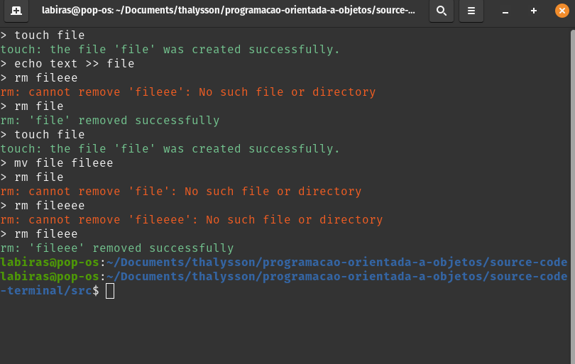

# Linux Terminal with Python

**Description**  
This project implements a basic Linux terminal in Python, with additional features and similars to Bash. The goal is to emulate a command-line shell, allowing the execution of system commands and interaction with the operating system.

## Technologies Used

- **Python**: Language Used for Development.
- **Libraries**:
  - `os`: For interaction with the operating system (executing commands, handling files, and processes).
  - `subprocess`: To execute system commands and retrieve their results.
  - `sys`: For handling paths and command-line arguments, as well as controlling the terminal output.
  - `threading`: For concurrent execution of tasks and process management in a multi-threaded environment.

## Features

- **Command Execution**: The terminal allows the user to execute system commands, such as `ls`, `mv`, `echo`, `touch`, `rm`, among others.
- **Process Management**: It is possible to start and manage system processes from the terminal.
- **Support for Simple Commands**: Implementation of some basic commands and simulation of their behaviors.
- **Interactivity**: The terminal accepts user input and displays the output in a manner similar to the Bash terminal.

## Installation

### Requirements

- Python installed on your system.
- No external dependencies are required, aside from Python's standard libraries.

##  Image:

